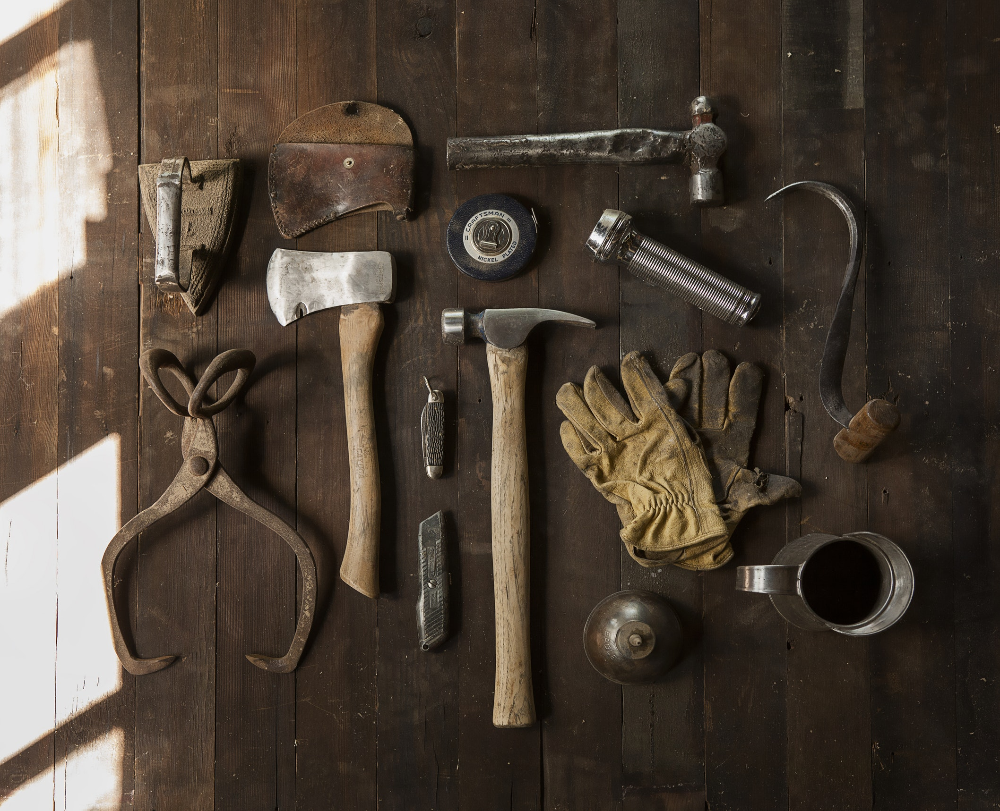

# Goods

Either you have your own place, start a new project or have new ideas you will need some materials or tools. Even if buying something new is an easy solution it's definitely not what you should aim for. It keeps the system growing and producing more for no reason. Trust me, you rarely need something new.

The first place you can visit is a **tip / recycling center**.  
There you can find everything and anything in various state. So you might find exactly what you were looking for. The perfect thing is that you know you're buying something that was supposely being thrown out.

Another way is to **ask companies** for their "waste". For instance, garages for their tires (that you can use for gardening), landscaping companies for their woods/cutted grass. You can also retrieve your local newspaper over-prints. There is many more possibilities, just think about where can you find what you need and try to contact this specific companies.

Often associated with food, **dumpster diving** can be applied to goods too. So go on, and jump on the dumpster of your local shop! (ok, be careful and read about the law of your country/city and be mindful about any sharp objects).

You can also rely on your **neighboors** by doing some power tools exchange or even services. Creating a community around you is really important. People helping each other should be a top priority. Even if you don't need anything right now, go over and connect.

**Bulky days** or anytime you find something interesting on the side of the road is also a good option. Check its conditions and if it fits your needs, pick it up!

Internet is also a great source to find cheap (even free) items. Just check your local **markeplace website** to find anything you like.

> [!NOTE]
> Here is some example of websites: ebay, gumtree, kijiji, craiglist, leboncoin, ...
